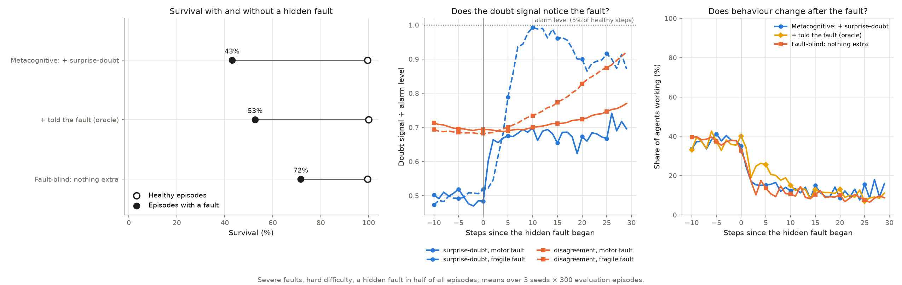
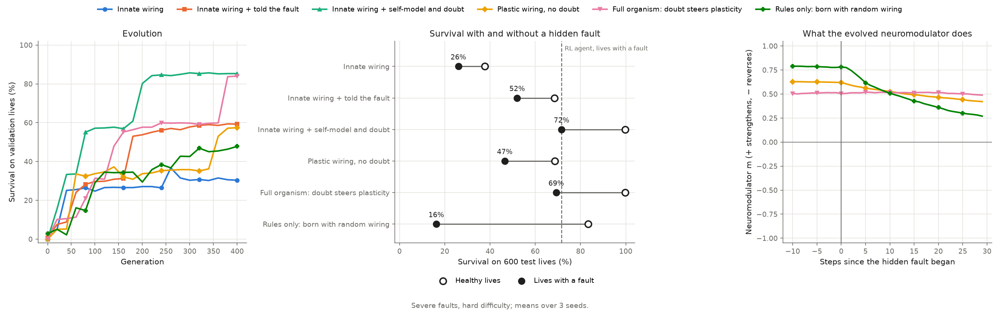

# Metacognitive Self-Referential Agent (MSRA)

## 📝 Overview
The **Metacognitive Self-Referential Agent (MSRA)** is a novel reinforcement learning architecture that integrates a predictive self-model with dynamic monitoring of endogenous uncertainty ("doubt"). Unlike standard RL agents that treat internal constraints as secondary, MSRA proactively imagines the physiological consequences of actions and modulates risk sensitivity based on its confidence in self-predictions.

### Key Innovations
- **Endogenous Uncertainty Monitoring**: Tracks prediction errors between imagined and actual internal states.
- **Dynamic Risk Modulation**: An "anxiety" parameter (β) adjusts based on doubt and resource scarcity.
- **Caution Mode**: Autonomous switching to conservative behavior when uncertainty exceeds thresholds.
- **Perfect Homeostasis**: Achieves 100% survival rates in stochastic resource-constrained environments.

## 🎯 Features
- **Self-Modeling**: Learns predictive models of internal state dynamics.
- **Metacognitive Loop**: Monitors and responds to prediction uncertainty.
- **Risk-Sensitive Control**: Dynamically adjusts behavior based on internal confidence.
- **Homeostasis Maintenance**: Optimally balances resource utilization and preservation.
- **Benchmark Comparisons**: Includes multiple baseline implementations for comparison.

## 📊 Results

| Agent Type           | Survival Rate | Final Resources | Caution Mode |
|---------------------|---------------|----------------|--------------|
| **MSRA (Ours)**      | 100%          | 0.98           | 4.4%         |
| Standard MBRL        | 67%           | 0.62           | N/A          |
| Risk-Neutral PPO     | 73%           | 0.71           | N/A          |
| Fixed-β Controller   | 81%           | 0.79           | 0%           |

For detailed results, visualizations, and experimental setup, see the accompanying documentation https://github.com/ismamsha/Self-Referential-AI-with-Proactive-Imagination-Metacognition/

## 🧠 Learning agent (MSRA-L)

`learning_agent.py` is a version of MSRA where every decision comes from learned
components. The agent is given no environment costs, thresholds or death rules.

- **Value learning:** Double DQN over the agent's internal state (resources, degradation, time).
- **Self-model:** an ensemble of 5 probabilistic networks that predicts the next internal
  state, the reward, and the chance of dying for each action.
- **Doubt:** disagreement between ensemble members, which measures uncertainty about the
  self-model. Random shocks are absorbed by each member's predicted variance, so they do
  not raise doubt.
- **Anxiety (β):** Eq. 10 of the paper. β scales a penalty on actions the self-model is
  unsure about, and makes the agent weigh dying β times more heavily than its learned
  probability implies (**fear of death**).
- **Imagination (optional):** Dyna-style extra training on transitions imagined by the self-model.

### Results

400 training episodes, then 200 evaluation episodes with no exploration; mean ± 95% CI
over 3 seeds. Full tables are in [`results/summary.md`](results/summary.md).

| Policy | Hard: survival | Hard: reward | Expert: survival | Expert: reward |
|---|---|---|---|---|
| Always rest | 57% | 1 | 8% | 3 |
| Four-line threshold rule | 54% | 33 | 4% | 18 |
| DQN (value learning only) | 79 ± 10% | 66 ± 13 | 29 ± 44% | 19 ± 5 |
| MSRA-L with doubt + fear of death | 99.5 ± 1.2% | 69 ± 1 | 2 ± 1% | 19 ± 4 |
| **Doubt + fear of death, no imagination** | **100 ± 0%** | **73 ± 4** | **34 ± 61%** | **25 ± 8** |

On normal difficulty every learning variant survives 100% of episodes, but so does resting
forever, so survival does not separate policies there. The best learners earn about
100 reward per episode, against 56 for the threshold rule.

What the ablations show:

- **Learned fear of death is what produces reliable survival.** On hard it lifts survival
  from 79% (DQN) to 100% and raises reward at the same time.
- **Doubt alone adds little here.** The environment's dynamics never change and are
  fully observed, so the self-model quickly becomes certain.
- **Imagination hurts under large, rare shocks.** Each self-model predicts a single
  bell-shaped outcome, which smears expert mode's big shocks into mild average ones, so
  imagined experience teaches the agent that risky states are safer than they are. With
  imagination off, the same agent goes from 2% to 34% survival on expert.
- **Expert results are noisy:** survival varies from 5% to 49% across seeds. Use more
  seeds before drawing conclusions there.


### Run it

```bash
pip install -r requirements.txt
python learning_agent.py --variant anxiety_real --difficulty hard --episodes 400
python run_experiments.py        # full grid: 5 variants x 3 difficulties x 3 seeds, ~1.5 h on 4 cores
```

`run_experiments.py` skips runs whose results already exist in `results/`; delete a JSON
file to rerun it.

## 🔧 Hidden-fault experiment

`fault_experiment.py` asks whether the agent can notice that its own body has changed.
In half of all episodes a hidden fault starts at a random step between 20 and 70. The
agent only ever sees its resources, damage and the time.

| Setting | Fault 1 | Fault 2 |
|---|---|---|
| Mild | Motor: work drains 0.25 × intensity extra resources | Battery: resting recovers a quarter as much |
| Severe | Motor: work drains 0.5 × intensity extra resources | Fragile: random shocks become 3× as frequent |

The agents share the same machinery (fear of death, no imagination) and differ only in
one extra input to their state:

- **Metacognitive:** surprise-doubt, a running average of how far reality lands from the
  self-model's prediction (signed, in units of the predicted spread).
- **Memory:** the raw last 4 transitions.
- **Oracle:** the true fault flag.
- **Fault-blind:** nothing extra.

### Results

Survival in episodes where a fault struck; mean over 3 seeds. Full tables with confidence
intervals: [`results/faults_mild/summary.md`](results/faults_mild/summary.md) and
[`results/faults_severe/summary.md`](results/faults_severe/summary.md).

| Agent | Mild faults | Severe faults | Severe fault caught within 15 steps |
|---|---|---|---|
| Fault-blind | 95% | 72% | 5% (its disagreement signal) |
| **Metacognitive** | **95%** | **43%** | **78%** (30% false alarms) |
| Told the fault (oracle) | 83% | 53% | – |
| Memory of last 4 steps | 32% | – | – |
| First design: doubt also drives β | 86% | – | – |

- **Surprise-doubt detects faults the agent cannot see.** It catches 78% of severe faults
  within 15 steps, against 30% false alarms on healthy stretches. Ensemble disagreement,
  the doubt signal of the earlier agents, barely reacts to faults.
- **Detecting the fault did not improve survival.** Even the oracle, told exactly when the
  fault began, survived less often than the fault-blind agent. With 500 training episodes,
  the extra input splits the agent's experience into a rare "broken" case that the value
  network learns poorly. The fault-blind agent learns one robust policy and reacts to the
  resources it can see. After a fault, every agent cuts back work in the same way.
- **The first design made things worse.** Feeding surprise-doubt into β with the paper's
  constants left the agent permanently over-anxious.
- **Results vary a lot between seeds** (the confidence intervals in the summaries are wide),
  so treat single numbers with care.

The open problem is using what the agent notices. One promising route is to let high
doubt switch the self-model onto recent experience, so that its death predictions, and so
the agent's fear, reflect the broken body.



### Run it

```bash
python fault_experiment.py --faults mild      # 6 agents x 3 seeds, ~1 h on 4 cores
python fault_experiment.py --faults severe    # 5 agents x 3 seeds
```

In the severe setting, only the metacognitive, oracle and fault-blind agents have been run
so far.

## 🧬 Evolved organisms

`organism.py` moves the whole metacognitive loop, and its learning rule, inside one small
network. Nothing is trained by backpropagation: evolution (OpenAI-ES) shapes an inherited
genome over generations, and within each life the network rewires itself with rules the
genome carries.

- **Plastic connections:** each weight is `W + A × Hebb`, and `Hebb` changes during life by
  a three-factor rule: presynaptic activity × postsynaptic activity × a neuromodulator.
- **Self-model inside the network:** a readout predicts how resources and damage will
  change after each action, and learns during life by the delta rule.
- **Doubt:** a running average of that readout's prediction error, fed back as an input.
- **Neuromodulator:** a unit that reads doubt and decides whether rewiring strengthens,
  stops or reverses.
- **Rules only:** the strictest version holds no weights at all. It is born with random
  wiring and an empty self-model, and inherits only each neuron's learning rule
  (161 numbers).

Six organisms were evolved on the severe hidden faults: 400 generations, 3 seeds each.
Full table: [`results/organism_severe/summary.md`](results/organism_severe/summary.md).

| Organism | Runs that evolved to survive* | Survival, healthy | Survival, fault |
|---|---|---|---|
| Innate wiring | 1 of 3 | 38% | 26% |
| + told the fault | 2 of 3 | 68% | 52% |
| Plastic wiring, no doubt | 2 of 3 | 69% | 47% |
| **+ self-model and doubt** | **3 of 3** | **100%** | **72%** |
| **Full organism: doubt steers plasticity** | **3 of 3** | **100%** | **69%** |
| Rules only (random wiring at birth) | 1 of 3 | 83% | 16% |

\*Healthy survival above 90% on 600 test lives.

- **Every organism with a self-model and doubt evolved successfully (6 of 6 runs);** the
  others managed 5 of 9. Doubt seems to make evolution reliable, perhaps because prediction
  errors give the network an informative signal about its own body. This is suggestive
  rather than proven: with 3 runs per organism the difference is not statistically
  significant (Fisher's exact test, p ≈ 0.09), and the doubt organisms also have larger
  genomes.
- **The rules-only organism can work.** One run went from random wiring to 98% healthy
  survival within each life, using only inherited learning rules. The other two runs did not
  get there in 400 generations.
- **The full organism's neuromodulator barely reacts to faults.** Evolution did not make
  doubt steer rewiring; the successful organisms use doubt as an input instead.

### Why nothing beats about 72% on faults

`survival_ceiling.py` uses dynamic programming over the known body dynamics to find the best
survival any policy could reach once a fault strikes, even one that knows the fault
instantly and meets it at full health:

| Fault (severe setting) | Best possible survival | Best agents reach |
|---|---|---|
| Motor | 100% | ~100% |
| Fragile body (3× shocks) | 72% | ~45% |

All the headroom is in the fragile fault, where surviving means stopping work entirely.
Every agent and organism keeps working a little, because the reward makes that worth the
risk of dying. The remaining gap comes from what the organisms are rewarded for, not from
missing information about the fault.

```bash
python organism.py --check                  # verify the vectorised environment (exact match)
python organism.py --faults severe          # 6 organisms x 3 seeds, ~1.5 h on 4 cores
python survival_ceiling.py --faults severe  # best possible survival, ~10 s
```



## 🗺️ Interactive diagram

[`docs/doubting_agent.html`](docs/doubting_agent.html) is an interactive diagram of the
agent's decision loop. It replays real recorded episodes: a hidden fault strikes, doubt
rises, and you can watch what the agent chooses at every step. Click any part of the
diagram for an explanation and the code that implements it. Open the file in a browser,
or rebuild it from the results with `python docs/build_page.py`.
