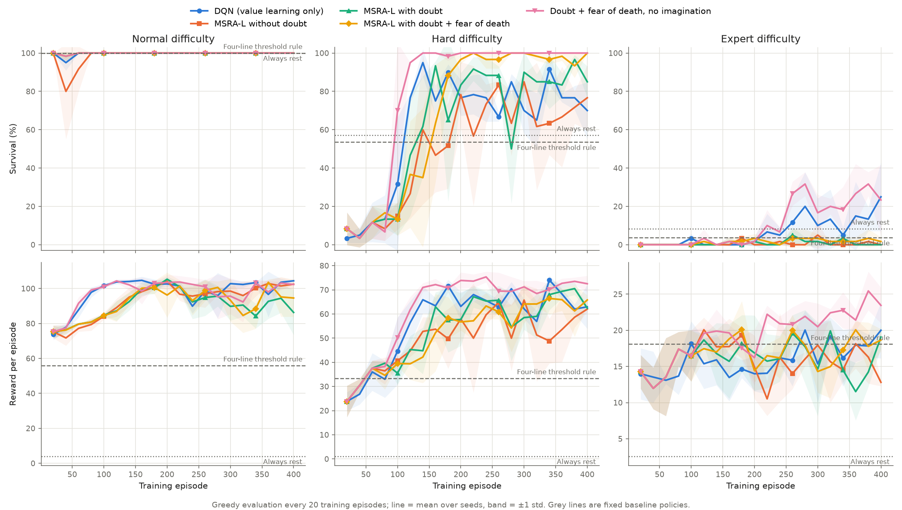

# Metacognitive Self-Referential Agent (MSRA)

## 📝 Overview
The **Metacognitive Self-Referential Agent (MSRA)** is a novel reinforcement learning architecture that integrates a predictive self-model with dynamic monitoring of endogenous uncertainty ("doubt"). Unlike standard RL agents that treat internal constraints as secondary, MSRA proactively imagines the physiological consequences of actions and modulates risk sensitivity based on its confidence in self-predictions.

### Key Innovations
- **Endogenous Uncertainty Monitoring**: Tracks prediction errors between imagined and actual internal states.
- **Dynamic Risk Modulation**: An "anxiety" parameter (β) adjusts based on doubt and resource scarcity.
- **Caution Mode**: Autonomous switching to conservative behavior when uncertainty exceeds thresholds.
- **Perfect Homeostasis**: Achieves 100% survival rates in stochastic resource-constrained environments.

## 🎯 Features
- **Self-Modeling**: Learns predictive models of internal state dynamics.
- **Metacognitive Loop**: Monitors and responds to prediction uncertainty.
- **Risk-Sensitive Control**: Dynamically adjusts behavior based on internal confidence.
- **Homeostasis Maintenance**: Optimally balances resource utilization and preservation.
- **Benchmark Comparisons**: Includes multiple baseline implementations for comparison.

## 📊 Results

| Agent Type           | Survival Rate | Final Resources | Caution Mode |
|---------------------|---------------|----------------|--------------|
| **MSRA (Ours)**      | 100%          | 0.98           | 4.4%         |
| Standard MBRL        | 67%           | 0.62           | N/A          |
| Risk-Neutral PPO     | 73%           | 0.71           | N/A          |
| Fixed-β Controller   | 81%           | 0.79           | 0%           |

For detailed results, visualizations, and experimental setup, see the accompanying documentation https://github.com/ismamsha/Self-Referential-AI-with-Proactive-Imagination-Metacognition/

## 🧠 Learning agent (MSRA-L)

`learning_agent.py` is a version of MSRA where every decision comes from learned
components. The agent is given no environment costs, thresholds or death rules.

- **Value learning:** Double DQN over the agent's internal state (resources, degradation, time).
- **Self-model:** an ensemble of 5 probabilistic networks that predicts the next internal
  state, the reward, and the chance of dying for each action.
- **Doubt:** disagreement between ensemble members, which measures uncertainty about the
  self-model. Random shocks are absorbed by each member's predicted variance, so they do
  not raise doubt.
- **Anxiety (β):** Eq. 10 of the paper. β scales a penalty on actions the self-model is
  unsure about, and makes the agent weigh dying β times more heavily than its learned
  probability implies (**fear of death**).
- **Imagination (optional):** Dyna-style extra training on transitions imagined by the self-model.

### Results

400 training episodes, then 200 evaluation episodes with no exploration; mean ± 95% CI
over 3 seeds. Full tables are in [`results/summary.md`](results/summary.md).

| Policy | Hard: survival | Hard: reward | Expert: survival | Expert: reward |
|---|---|---|---|---|
| Always rest | 57% | 1 | 8% | 3 |
| Four-line threshold rule | 54% | 33 | 4% | 18 |
| DQN (value learning only) | 79 ± 10% | 66 ± 13 | 29 ± 44% | 19 ± 5 |
| MSRA-L with doubt + fear of death | 99.5 ± 1.2% | 69 ± 1 | 2 ± 1% | 19 ± 4 |
| **Doubt + fear of death, no imagination** | **100 ± 0%** | **73 ± 4** | **34 ± 61%** | **25 ± 8** |

On normal difficulty every learning variant survives 100% of episodes, but so does resting
forever, so survival does not separate policies there. The best learners earn about
100 reward per episode, against 56 for the threshold rule.

What the ablations show:

- **Learned fear of death is what produces reliable survival.** On hard it lifts survival
  from 79% (DQN) to 100% and raises reward at the same time.
- **Doubt alone adds little here.** The environment's dynamics never change and are
  fully observed, so the self-model quickly becomes certain.
- **Imagination hurts under large, rare shocks.** Each self-model predicts a single
  bell-shaped outcome, which smears expert mode's big shocks into mild average ones, so
  imagined experience teaches the agent that risky states are safer than they are. With
  imagination off, the same agent goes from 2% to 34% survival on expert.
- **Expert results are noisy:** survival varies from 5% to 49% across seeds. Use more
  seeds before drawing conclusions there.



### Run it

```bash
pip install -r requirements.txt
python learning_agent.py --variant anxiety_real --difficulty hard --episodes 400
python run_experiments.py        # full grid: 5 variants x 3 difficulties x 3 seeds, ~1.5 h on 4 cores
```

`run_experiments.py` skips runs whose results already exist in `results/`; delete a JSON
file to rerun it.
